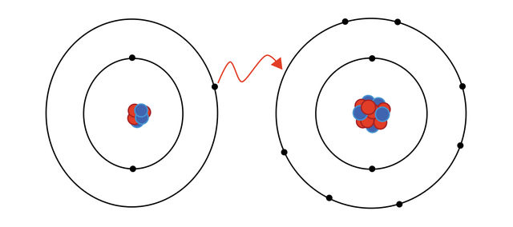
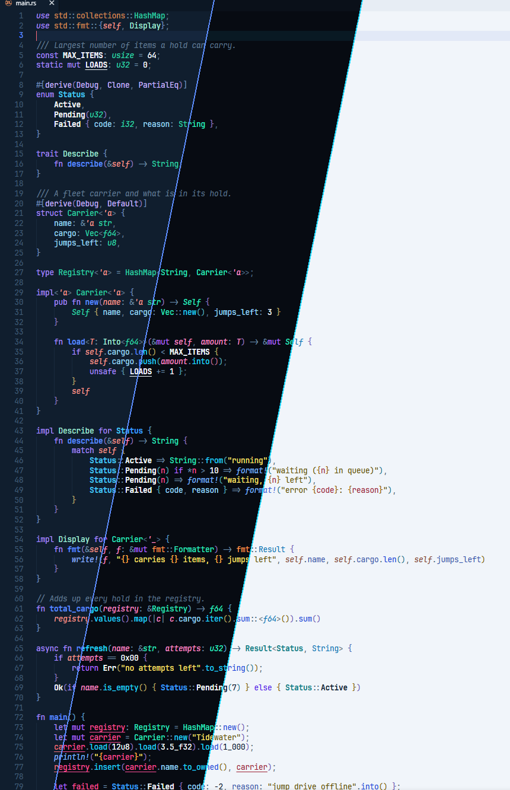
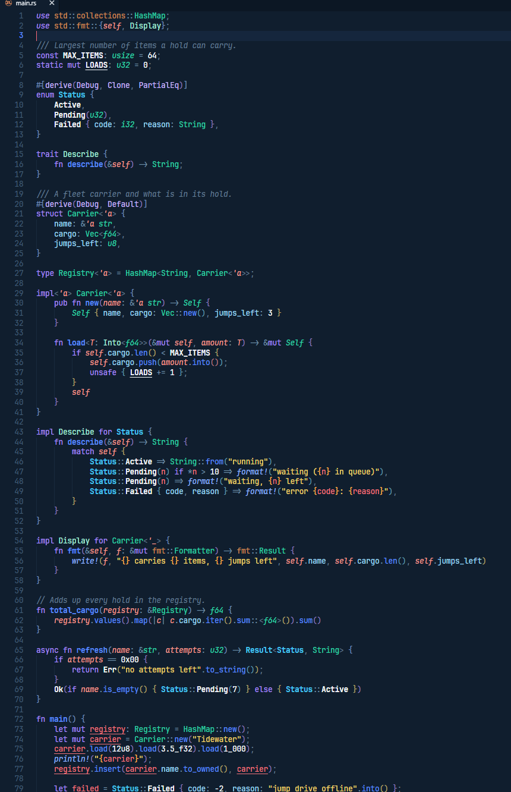
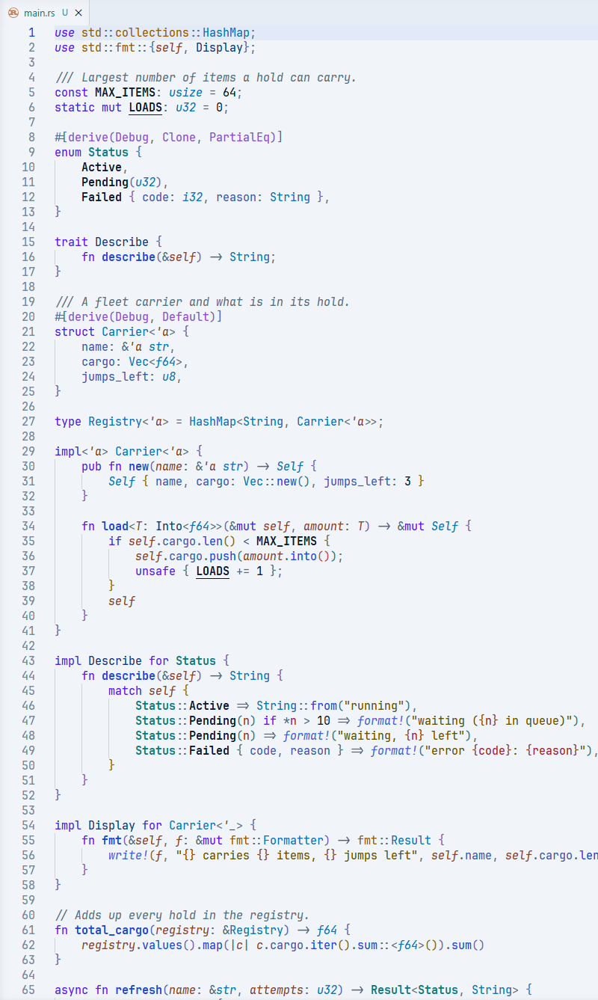

# Ion
  

### Inspired by how the atoms are drawn -- focusing on a blue/red blend with some sparkles on top.

I tried to give every kind of token its own color.  
One Dark Pro does this quite well so I took some inspirations from it.

### Supported Languages

Due to my preference on Rust, C (++, #), Python and Svelte \w Typescript. The theme works best with those languages in particular.

### Font Choices

Ion uses italic and bold a lot to tell similar tokens apart, so a font with real italics helps. I prefer to go with JetBrains Mono but Cascadia Code can work too.

## Showcase:

## Variants

### **Ion** - Dark Original Variant.

### **Ion Light** - Light Variant

